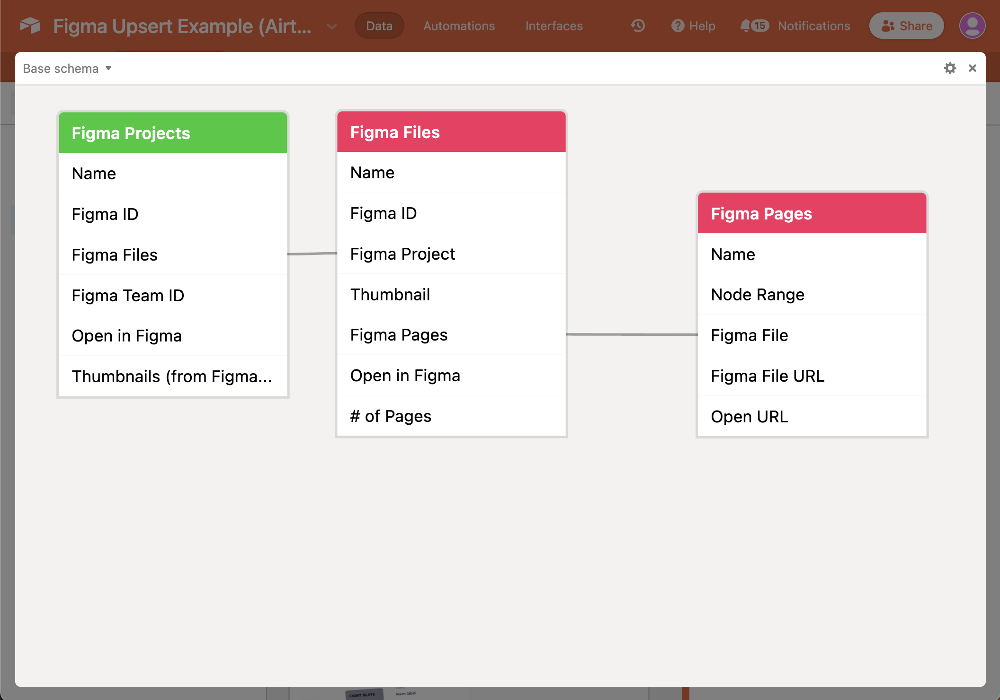

# Import list of Figma projects, files, and pages into Airtable

This code example can be used to update or insert ("upsert") your team's lists
of Figma projects, files, and pages into Airtable. This can help you organize
your design projects, their statuses, and tasks. You can schedule this script to
run on a recurring schedule to keep your Airtable base "in sync" with Figma.

This code example is based on
[the generic airtable.js upsert example](.../../../../../javascript/using_airtable.js/)
and uses [`Airtable.js`](https://github.com/airtable/airtable.js) (maintained by
Airtable) to interact with the Airtable REST API and
[`figma-js`](https://github.com/jemgold/figma-js/) (community-supported, not by
Figma) to connect to Figma's API.

The following screenshots show the gallery view of files and the base schema of
the sample base linked to in the instructions below.

|  |  |
| -------------------------------------------------------------------------------------------------------------------- | ---------------------------------------------------------------- |

---

The software made available from this repository is not supported by Formagrid
Inc (Airtable) or part of the Airtable Service. It is made available on an "as
is" basis and provided without express or implied warranties of any kind.

---

### Local setup

1. Clone/unzip code
2. Copy `.env.example` to `.env` and populate values.
   - Explanations of each environment variable is available below
   - Use [this sample base](https://airtable.com/shrfCm59kGIWxc7xo) which has
     the correctly named tables (Figma Projects, Figma Files, and Figma Pages)
     and fields.
3. Install Node dependencies using `npm install`
4. Run `npm run sync` to run the script

### Key files and their contents

- [`index.js`](index.js) is the main code file which is executed when
  `npm run sync` is run. At a high level, it:
  - Loads environment variables, dependencies, and defines the table and field
    names that align with the template base linked to above.
  - Retrieves all projects for the given team ID and upserts them to the 'Figma
    Projects' table in Airtable
  - Loops through each project and upserts the list of files to the 'Figma
    Files' table in Airtable
  - Optionally, loops through each file and upserts the list of pages to the
    'Figma Pages' table in Airtable
- [`airtable_helpers.js.js`](airtable_helpers.js.js) is referenced by
  [`index.js`](index.js) and contains helper functions to for upserting and
  batching record actions.
- [`.env.example`](.env.example) is an example file template to follow for your
  own `.env` file. The environment variables supported are:
  - `AIRTABLE_API_KEY` -
    [your Airtable personal access token](https://support.airtable.com/docs/creating-and-using-api-keys-and-access-tokens)
    with
    [`data.records:read`](https://airtable.com/developers/web/api/scopes#data-records-read)
    and
    [`data.records:write`](https://airtable.com/developers/web/api/scopes#data-records-write)
    scopes and access to the base ID below
  - `AIRTABLE_BASE_ID` - the ID of your base; you can find this on the base's
    API docs from https://airtable.com/api. This will always start with `app`
  - `FIGMA_PERSONAL_ACCESS_TOKEN` -
    [your Figma Personal Access Token](https://www.figma.com/developers/api#authentication)
  - `FIGMA_TEAM_ID` - your Figma Team ID, which can be
    [retrieved using these instructions](https://www.figma.com/developers/api#get-team-projects-endpoint)
  - `POPULATE_PAGES_TABLE` - a boolean string; when set to `true`, the 'Figma
    Pages' table in Airtable will be populated as well. Defaults to `false`
    since pages take significantly longer to retrieve than projects and files.
